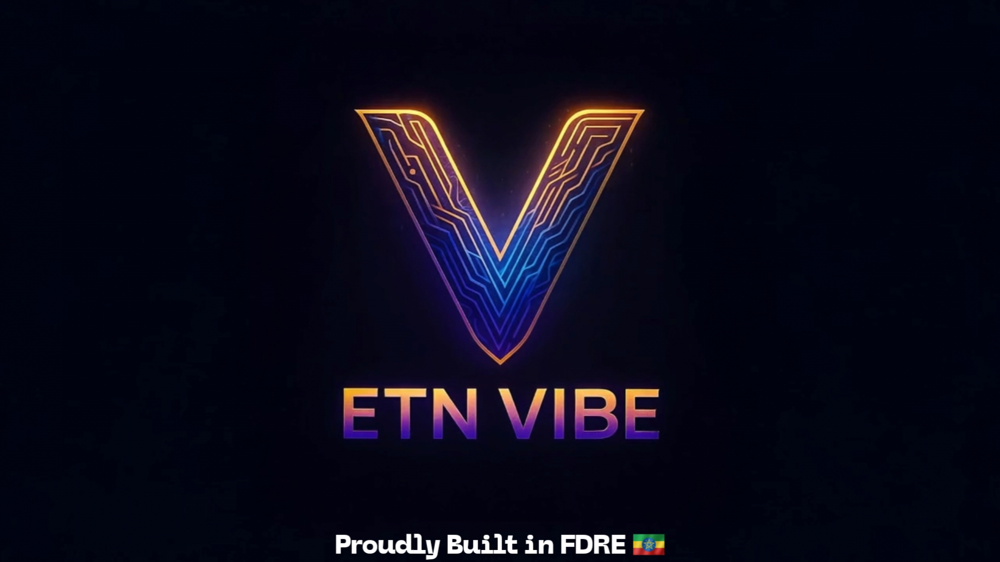
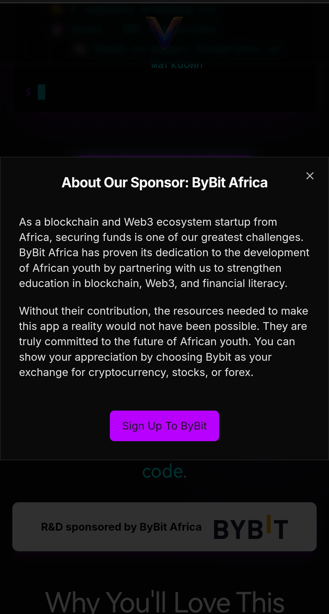

🌍 ETN Vibe ይፋዊ ቤታን ጀመረ፡ የአፍሪካ የመጀመሪያው Vibe Coding AI መተግበሪያ ስራ ጀመረ

አዲስ አበባ፣ ኢትዮጵያ — ጁላይ 3፣ 2025 – የ ETN ስነ-ምህዳር የዓለማችንን የመጀመሪያው በ AI የሚሰራ "vibe coding" መድረክ የሆነውን ETN Vibe ይፋዊ ቤታ መልቀቁን በኩራት ያበስራል። ይህ መድረክ ፈጣሪዎች የመተግበሪያ ሀሳቦቻቸውን ሙሉ በሙሉ ወደተዋቀሩ የልማት ንድፎች (blueprints) እንዲቀይሩ ለመርዳት ታስቦ የተሰራ ነው — ያውም አንዲት መስመር ኮድ ሳይጽፉ።

<!-- truncate -->

ለህልመኞች፣ ፈጣሪዎች፣ ስራ ፈጣሪዎች፣ እና ግንበኞች በመላው አፍሪካ እና ከዚያም በላይ የተገነባው፣ ETN Vibe ቴክኒካዊ እውቀት የሌላቸው ተጠቃሚዎችን የሚከተሉትን እንዲያመነጩ በማስቻል ያበቃቸዋል፡-

*   📄 ሙሉ-ስታክ PRD (የምርት መስፈርቶች ሰነድ)
*   🎨 የብራንዲንግ እና የስታይል መመሪያ
*   ⚙️ የ Frontend + Backend ገንቢ ትዕዛዞች (prompts)
*   🛠️ ለ AI-ተስማሚ የሆኑ የኮድ ንድፎች
*   🌐 ለ ኤክስፖርት ዝግጁ የሆኑ የፕሮጀክት መዋቅሮች

ሁሉም የሚከናወኑት ጥቂት የሚታወቁ ጥያቄዎችን በመመለስ ብቻ ነው።

"መተግበሪያዎችን የመገንባት ችሎታ ኮድ በሚረዱ ሰዎች ብቻ መገደብ የለበትም ብለን ሁልጊዜ እናምናለን። ETN Vibe በራዕይ እና በአፈፃፀም መካከል ያለው የጎደለ ግንኙነት ነው፣" ይላሉ የ ETN ስነ-ምህዳር መስራች ጄሰን ፒተርስ።

🔑 በአፍሪካ የተገነባ። በ ByBit የተደገፈ።

እንደ ሰፊው የ ETN ስነ-ምህዳር አካል፣ ETN Vibe እውን የሆነው ከ ByBit Africa ጋር በተደረገ ስትራቴጂካዊ አጋርነት ነው። የእነሱ ድጋፍ ለአፍሪካ ወጣቶች በብሎክቼይን፣ በ Web3 እና በፋይናንስ እውቀት ዘርፎች ትምህርትን፣ ተደራሽነትን እና መሰረተ ልማትን ለማቀጣጠል ረድቷል።

"ByBit Africa በራዕያችን ላይ ያደረገው ኢንቨስትመንት ለአፍሪካ ፈጠራ የወደፊት እድል ያላቸውን እውነተኛ ቁርጠኝነት ያሳያል። ይህንን መድረክ እውን ለማድረግ የነበራቸው ሚና ቀላል አይደለም፣" ብለዋል ፒተርስ።

ተጠቃሚዎች ByBitን ለክሪፕቶ፣ ለአክሲዮኖች እና ለፎክስ (forex) ተመራጭ ልውውጥ አድርገው በመምረጥ ድጋፋቸውን እንዲያሳዩ ይበረታታሉ።

💥 የመተግበሪያ ግንባታ አዲስ ዘመን

መድረኩ በይፋ ወደ ህዝባዊ ቤታ የገባው በጁላይ 3፣ 2025 ሲሆን በአሁኑ ጊዜ ለሁሉም ተጠቃሚዎች ነፃ ነው። ይህ መድረክ ነጻ ሆኖ እንዲቀጥል ወይም እንዳይቀጥል ለተጠቃሚዎች ምርጫ የሚሰጥበት የክብር ስርዓት (honor System) እየተተገበረ ነው፤ ሆኖም ልገሳዎች ለ Generation አገልግሎቶች እና ለመድረክ ወጪዎች የሚያስፈልገውን የገንዘብ መጠን ካላሟሉ፣ በቅርቡ የሚከፈልባቸው ደረጃዎች (Paid tiers) በመላው የ ETN ስነ-ምህዳር በሚሰራው $ETN ቶኬን በኩል ይኖራሉ። ተጠቃሚዎች የፕሪሚየም ባህሪያትን፣ ተጨማሪ ትውልዶችን (generations)፣ እና በመጨረሻም — ያለምንም የትዕዛዝ ድካም (zero prompt fatigue) መተግበሪያዎችን መፍጠር የሚችሉ agentic AI flows መጠበቅ ይችላሉ።

💡 ስለ ETN Vibe

ETN Vibe በ ETN ስነ-ምህዳር ውስጥ ዋና ምርት ነው፣ የሶፍትዌር ልማትን በከፍተኛ ሁኔታ ለማዳረስ (democratize) የተቀረፀ። ባህላዊ የቴክኒክ እንቅፋቶች ሳይኖሩ የአፍሪካን ተሰጥኦ ወደ ዓለም አቀፉ የ Web3 ጠፈር ለማምጣት ከተገነቡት እያደጉ ያሉ መሳሪያዎች ስብስብ አንዱ ነው።

“Figma + GPT + ከወደፊቱ የመጣ የምርት አስተዳዳሪን አስቡ — ያ ETN Vibe ነው።”

🚀 የበለጠ ይወቁ

🌐 ድህረ ገጽ: https://etn-vibe.ethiotech.net.et
🔗 ማህበረሰቡን ይቀላቀሉ: https://t.me/et_apps
🪙 የቶኬን መረጃ: https://tonviewer.com/EQAz_XrD0hA4cqlprWkpS7TIAhCG4CknAfob1VQm-2mBf5Vl

---

🧠 በ MaqdalaGPT የሚሰራ

ETN Vibe የሚሰራው በ MaqdalaGPT ነው፣ ይህ የ ETHIO TECH AI ዋና LLM ሲሆን በኢትዮጵያ ውስጥ ከ Google Vertex AI ጋር በመሆን በተለይ ለአፍሪካ ተስተካክሎ (tuned) የተሰራ ነው።

---

ለሚዲያ ጥያቄዎች፣ ቃለ-መጠይቆች፣ ወይም የአጋርነት እድሎች:
📩 [team@etn.ethio-tech.com](mailto:team@etn.ethio-tech.com)

#BuildWithTheVibe
#ETNVibe
#ByBitAfrica
#AfricanInnovation
#Web3ForAll
