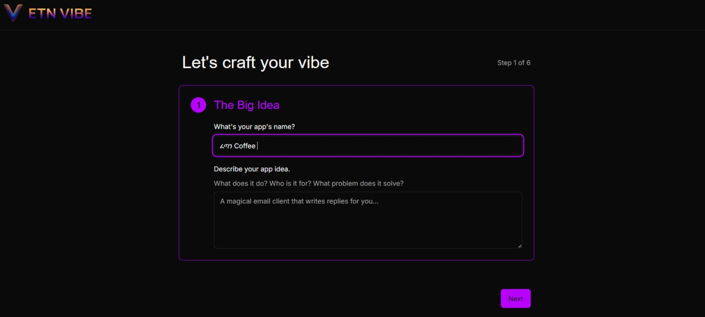

🌍 ETN Vibe запускает публичную бету: Первый в Африке ИИ для "Vibe Coding" начал работу

АДДИС-АБЕБА, Эфиопия — 3 июля 2025 г. — Экосистема ETN с гордостью объявляет о запуске публичной бета-версии **ETN Vibe**, первой в мире платформы "vibe coding" на базе ИИ, созданной для того, чтобы помочь творцам превращать идеи приложений в полностью структурированные схемы разработки — без написания единой строчки кода.

<!-- truncate -->

Созданный для мечтателей, творцов, предпринимателей и строителей по всей Африке и за ее пределами, ETN Vibe позволяет пользователям без технических знаний генерировать:

*   📄 Полный пакет PRD (Документ с требованиями к продукту)
*   🎨 Руководство по брендингу и стилю
*   ⚙️ Промпты для frontend и backend разработчиков
*   🛠️ Схемы кода, готовые для ИИ
*   🌐 Структуры проектов, готовые к экспорту

Всё это делается путем ответов на несколько простых интуитивных вопросов.

"Мы всегда верили, что способность создавать приложения не должна ограничиваться только теми, кто понимает код. ETN Vibe — это недостающее звено между видением и исполнением", — говорит Джейсон Питерс, основатель Экосистемы ETN.

🔑 Создано в Африке. При поддержке ByBit.

Являясь частью более широкой Экосистемы ETN, ETN Vibe стал реальностью благодаря стратегическому партнерству с ByBit Africa. Их поддержка помогла нам стимулировать образование, доступ и инфраструктуру для африканской молодежи в сферах блокчейна, Web3 и финансовой грамотности.

"Инвестиции ByBit Africa в наше видение показывают их истинную приверженность будущему африканских инноваций. Их роль в реализации этой платформы была неоценимой", — отмечает Питерс.

Пользователям предлагается продемонстрировать поддержку, выбрав ByBit в качестве предпочтительной биржи для крипто, акций и форекс.

💥 Новая эра создания приложений

Платформа официально вошла в публичную бету 3 июля 2025 года и в настоящее время бесплатна для всех пользователей. Внедряется "система чести", где пользователи могут выбирать, оставить ли платформу бесплатной; однако, если пожертвования не покроют расходы на генерацию и платформу, вскоре появятся платные уровни через $ETN Ecosytem Token. Пользователи могут ожидать премиум-функции, дополнительные генерации и, в конечном итоге, "агентные ИИ-потоки", которые смогут создавать приложения без усталости от промптов.

💡 О ETN Vibe

ETN Vibe — это флагманский продукт в Экосистеме ETN, разработанный для демократизации разработки программного обеспечения. Это один из растущего набора инструментов, созданных для того, чтобы вывести африканские таланты в глобальное пространство Web3 — без традиционных технических барьеров.

"Представьте Figma + GPT + Менеджер продукта из будущего — это и есть ETN Vibe."

🚀 Узнать больше

🌐 Веб-сайт: https://etn-vibe.ethiotech.net.et
🔗 Присоединяйтесь к сообществу: https://t.me/et_apps
🪙 Инфо о токене: https://tonviewer.com/EQAz_XrD0hA4cqlprWkpS7TIAhCG4CknAfob1VQm-2mBf5Vl

---

🧠 Работает на MaqdalaGPT

ETN Vibe работает на базе MaqdalaGPT, флагманской LLM от ETHIO TECH AI, настроенной в Эфиопии с использованием Google Vertex AI специально для африканского контекста.

---

Для запросов СМИ, интервью или возможностей партнерства:
📩 [team@etn.ethio-tech.com](mailto:team@etn.ethio-tech.com)

#BuildWithTheVibe
#ETNVibe
#ByBitAfrica
#AfricanInnovation
#Web3ForAll
